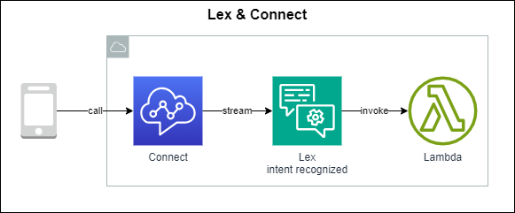

Advanced Amazon S3
===================================

Rekcognition
------------------------------------------------------------------------

Find objects, people, text, scenes in images and videos using machine learning. Facial analytics and facial search for user verifying and people couting

Use cases: Labeling, Content Moderation, Text Detection, Face Detection and Analysis (gender, age range, emotions ...), Face Search and Verification, Celebrity Recognition, Pathing (ex: for sport game analysis)

Transribe
------------------------------------------------------------------------

Use automatically speech recognition (ASR) deep learning process to convert speech to text.

Function: automatically remove Personally Identifiable Information (PII) using Redaction, support Automatic Language Identification for multi-ligual audio

Use cases: transcribe customer service calls, automate closed captioning and subtiling, generate metadata for media assets

Polly
------------------------------------------------------------------------

Use deep learning to convert text to lifelike speech

Function: SynthesizeSpeech operation customizes the pronunciation of words using Pronunciation Lexicons, support Speech Synthesis Markup Language (SSML)

Translate
------------------------------------------------------------------------

Lex + Connect
------------------------------------------------------------------------

Comprehend
------------------------------------------------------------------------

Natural Language Processing (NLP) serverless service

Comprehend Medical
------------------------------------------------------------------------

SageMaker
------------------------------------------------------------------------

Forecast
------------------------------------------------------------------------

Kendra
------------------------------------------------------------------------

Personalize
------------------------------------------------------------------------

Textract
------------------------------------------------------------------------

Summary
------------------------------------------------------------------------

