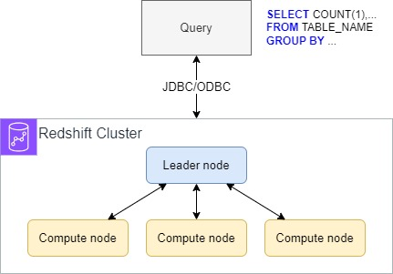

Data Analytics
===================================

Athena
------------------------------------------------------------------------

Redshift
------------------------------------------------------------------------

Redshift is based on PostgreSQL used for OLAP

Columnar storage of data, support parallel query

BI tools: AWS Quicksight or Tableau

Modes: Provisoned cluser or Serverless cluster

Redshift cluster node types: Leader node and Compute node

Snapshot & RD: Reshift has Multi-AZ mode, snapshot is stored in S3. Support automatically copying snapshot to other region

Redshift data ingestion: AWS Kinesis, S3 COPY, JDBC Driver

Redshift Spectrum: query data in S3 without loading it

AWS Opensearch
------------------------------------------------------------------------

ElasticSearch

Two modes: managed cluster or serverless cluster

Common patterns: DynamoDB --> DynamoDB Stream --> Lambda --> AWS Opensearch

Cloudwatch Logs --> Subscription Filter --> Lambda (managed by AWS) -realtime->  AWS Opensearch

Cloudwatch Logs --> Subscription Filter --> Kinesis Data Firehose -near-realtime-->  AWS Opensearch

Kinesis Data Streams --> Kinesis Data Firehose -near-realtime-->  AWS Opensearch

AWS EMR
------------------------------------------------------------------------

Elastic MapReduce

EMR can create Hadoop clusers to analyze and process vast amount of data

EMR should be bundled with Apache Spark, HBase, Presto, Flink

Use cases: data processing, machine learning, web indexing, big data

EMR cluster: master node, core node, task node

AWS Quicksight
------------------------------------------------------------------------

Serverless machine learning-powered business intelligence service to create interactive dashboards

Use cases: business analytics, building visualizations, perform ad-hoc analysis, get business insights using data

Use SPICE engine to perform in-memory computation (require data to be imported to Quicksight)

Integration: RDS, Aurora, Redshift, Athena, S3, Opensearch, Timestream, Datasource Saas (Jira), Op-Promises Databases, Datasource import (xlsx, csv, json)

Quicksight has it own user and group (not IAM)

AWS Glue
------------------------------------------------------------------------

ETL is serverless service to prepare and transform data for analytics

Convert data into Parquet format

Glue Job Bookmarks: prevent re-processing old data

Glue Elastic Views

Glue DataBrew

Glue Studio

Glue Streaming ETL

AWS Lake Formation
------------------------------------------------------------------------

Use to create Data Lake

It automates many complex manual steps (collecting, cleansing, moving, cataloging data) and de-duplicate (using ML Transforms)

Centralize permissions (access control row and column level)

AWS Kinesis Data Analytics
------------------------------------------------------------------------

Kinesis Data Analytics for SQL and Kinesis Data Analytics (Amazon Managed Service) for Apache Flink

Amazon Managed Streaming for Apache Kafka (AWS MSK)
------------------------------------------------------------------------

Alternative for Kinesis

Big Data Ingestion Pipeline
------------------------------------------------------------------------

.. image:: big-data-ingestion-pipeline.png
